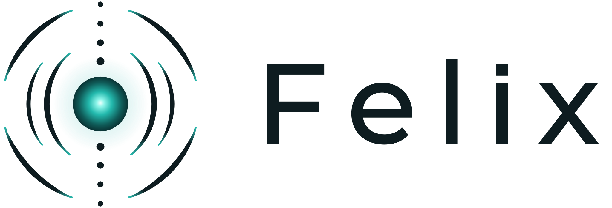
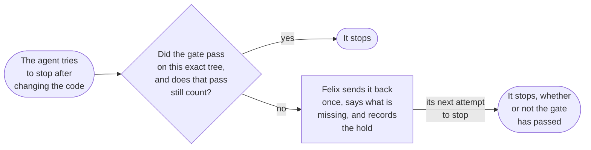

<div align="center">

<picture>
  <source media="(prefers-color-scheme: dark)" srcset="assets/felix-lockup-dark.svg">
  
</picture>

### Your agent says the work is done. Felix checks.

Felix exists so a coding agent isn't the only judge of whether its own work is done.<br>
Today it's a plugin for Claude Code, Anthropic's coding agent. When an agent that changed your code<br>
tries to finish before it has passed your project's checks, Felix sends it back once and says what's missing.

[](https://github.com/LeavesJ/Felix/actions/workflows/suite.yml)
[](#install)
[](engine/harness)
[](https://github.com/LeavesJ/Felix/blob/main/LICENSE)

**[How it works](#how-it-works)** &nbsp;·&nbsp; **[One change, start to finish](#one-change-start-to-finish)** &nbsp;·&nbsp; **[Try it](#try-it)** &nbsp;·&nbsp; **[Why you might not want it](#why-you-might-not-want-felix)** &nbsp;·&nbsp; **[Status](#status)** &nbsp;·&nbsp; **[Install](#install)**

</div>

## The failure it exists for

Say you ask a coding agent to add Google login. It spends two hundred steps on
it, runs the tests about halfway through, and keeps editing after that. Then it
tells you everything passes. It did pass, on an earlier version of the code.

Nobody checked that last claim but the agent. Felix is a Claude Code plugin,
written in bash, that steps in at that moment. Your project names a **gate**:
one shell command it trusts to say whether the code works, like
`npm run verify` or `cargo test`. `felix gate` runs it along with any other checks the project has
set up, and records whether they passed and exactly which code they ran on.
Felix calls that code the **tree**. When the agent tries to stop, meaning end
its turn and hand control back to you, and the code has changed, with
uncommitted edits or commits made in this session, Felix compares the tree as
it is now with the tree the gate last ran on. If they differ, or the gate
failed on that same tree, it sends the agent back once, with a message saying
why. Felix calls that a **hold**. A second attempt to stop goes through.

Across 43 of my sessions between August 10 and September 21, 2026, counted from
their transcripts and Felix's logs, Felix held an agent's attempt to stop 206
times. All but three had one of three causes. In 135 the gate had last run on a
different tree. In 39 it had never run in that checkout, which is where a fresh
worktree starts. In 29 it had failed on the exact tree the agent was stopping
on. Sent back, the agent reran the gate roughly 130 times, so not every hold
led to a rerun, and at least 15 of those runs failed. Without the hold, it would have stopped before running any
of them.

I built Felix for my own work, which is one person, a handful of repositories,
and agents doing most of the engineering. Most of Felix was written by the
agents it governs, under its own gate.

## How it works

Claude Code lets a plugin run code at set moments. Felix's Stop hook runs each
time the agent tries to end its turn and hand control back to you. Each time
`felix gate` runs, Felix writes a **receipt**: which tree the gate ran on, and
whether it passed. The tree is the last commit, every uncommitted edit and
every new file git doesn't ignore. The Stop hook reads the receipt.

A passing receipt stops counting when the tree changes. It also stops
counting, with no file in the tree changed, when something the project asked
Felix to watch changes, or when the project edits its own rules about what has
to pass, which Felix keeps in its home. [Exactly what
counts](#why-not-just-run-the-tests-in-ci) is under "Why not just run the tests
in CI?".



The hold tells the agent to run the gate and not to call the work complete
until it passes, and in my sessions held agents reran it roughly 130 times. But
after Felix sends the agent back, the agent's next attempt to stop goes through
without a check, whatever it did in between. Felix records the hold, but not
the unchecked stop that follows it. When some other hook sends the agent back
or wakes it, Felix checks the next stop as usual.

In the message the agent gets, "you" is the agent, "the founder" is the person
who owns the project, a red gate is one that failed, and an obligation is
something the project must satisfy before the work counts as done (the next
section walks through one):

```
The gate last ran at 2026-09-19T20:37:10Z, on a different tree. It has not seen this work.

Do not describe this work as complete until it has passed.

  felix gate

If you have already decided to stop with a red gate, that is the founder's call
to make, not yours: they can set FELIX_ALLOW_RED=1 in the environment they
launch a session from. If the red is one TASK_BLOCKING obligation, the narrower
way past it is a row in the project's exceptions.tsv, keyed to that obligation
and dated, merged by a person; a session cannot grant itself one.
```

## One change, start to finish

Say your app moves money between friends, and you ask an agent to add
transfers. Here is that change followed through, with what Felix does today
marked at each step.

1. **A risk nobody wrote down.** If the app retries after a dropped connection,
   or someone taps Send twice, the same payment could go through twice. The
   agent's tests never try that, so they pass either way.
2. **Unchecked counts as not done.** The project lists "the same payment can't
   go through twice" as an **obligation**: something it owes before it ships,
   with a command that checks it. Until a real check exists, that command can
   only report that it couldn't look, and Felix treats "couldn't check" the
   same as "failed". The gate fails, the agent is sent back, and `felix merge`,
   Felix's own command for merging a branch, won't merge it. *Built. A person
   writes the obligation and its check. An AI model can suggest obligations,
   only advisory ones that never block, and none has been accepted into a
   project yet.*
3. **Finding something that can check it (not built).** Felix would work out
   for itself that transfers need this check, and find or build something that
   can run it. *Today a person writes the test.*
4. **A proof tied to the exact code.** Someone writes a test that sends the
   same payment twice at once and checks that only one goes through. The gate
   runs it and passes, and the receipt names the exact tree the pass was for.
   *Built.*
5. **Merging.** `felix merge` refuses the branch unless the gate passed on
   exactly this tree, that pass still counts, and every obligation marked as
   blocking release is met. A change a revert can't undo, like a credential in
   the diff or a database migration, goes to a person whatever the tests say.
   *Built, but only when you merge with `felix merge`. GitHub's `gh pr merge`
   skips all of it, and so does GitHub's auto-merge, which `felix automerge
   --enable` turns on for a repository. Deploying isn't built: Felix stops at
   the merge.*
6. **The proof goes stale.** Next week someone changes the transfer logic. The
   old receipt was about the old code, so it stops counting. An agent that
   edits that code and tries to finish is sent back once to run the gate again, and `felix merge` won't
   take the branch until it passes on the new code. *Built.*

Steps 2, 4, 5 and 6 are one loop: write down what must be true, count what
nobody could check as not done, tie every proof to the exact code it checked,
let only a current proof through Felix's merge, and throw the proof away when
the code moves. Felix calls that loop the **trust plane**: the part that
decides whether finished work can be believed. It's most of what runs today.
Step 3, working out what a project needs and finding the tools and agents that
can supply it, is the **capability plane**. Of that half, Felix today installs
a starter set of plugins for a project, finds new plugins and reads their
contents before installing any, suggests a tool the first time a session's
prompt matches one of its routes, and records which tools sessions use. Choosing and running the agents a
task needs is designed, not built.

All of it runs inside the agent's session or on your machine, so it catches an
agent that forgets, not one working to get round it ([why you might not want
Felix](#why-you-might-not-want-felix)).

### Other guards

| Guard | What it does |
|:---|:---|
| **The merge escapes** | `felix merge` picks out the changes a revert can't undo and leaves them for a person: a credential in the added lines, a change to a CI workflow (workflows run with the repository's secrets), a change to the autonomy grant or the exception table, a migration or destructive SQL, and a change that removes rows from an enforcing table kept in the repository being merged, which today means only Felix's own ([escape.sh](engine/harness/lib/escape.sh)). Only on the `felix merge` path. `gh pr merge` skips it |
| **The judge on main** (Felix's own repository) | At merge, a change to Felix itself is judged by the copy of Felix on main, never by the candidate ([resolve.sh](engine/harness/lib/resolve.sh)). That rule came from one day on which nine engine changes in a row were each deployed before being judged, so each one judged itself. `felix gate` doesn't pin its judge yet |
| **Checker qualification** | For each checker a project declares, `felix qualify` plants every mutation its table names, each under one of six kinds of control, and requires the checker to fail or pass as that kind demands. A checker missing any of the six kinds is reported, not refused ([qualify.sh](engine/harness/lib/qualify.sh)). So far only Felix's own checkers are declared |
| **Plugin discovery** | Plugins Felix finds on its own are fetched, at the catalogue's pinned commit where it lists one, and read before anything installs. The install fetches its own copy, and Felix compares the two afterwards and reports a difference rather than undoing it. A hook, a floating version or an interpolated secret marks one high risk, and high risk never installs ([discover.sh](engine/harness/lib/discover.sh)). That check says of itself that it "catches carelessness, not an attacker" |
| **The deny table** | Before a Bash, Edit, Write, Read, NotebookEdit or WebFetch call runs, Felix matches its command, file path or URL against the project's `deny.tsv` and refuses a match with its reason ([deny.sh](engine/harness/lib/deny.sh)). It matches spellings, not intent, and skips a rule broad enough to catch ordinary work. `felix new` writes no table, so a new project refuses nothing |

### Words Felix uses

| Word | What it means |
|:---|:---|
| gate | The shell command your project trusts to say whether the code works. `felix gate` runs it with the project's other checks and writes one receipt for all of them |
| tree | The code as it stands: the last commit, every uncommitted edit and every new file git doesn't ignore |
| receipt | The record of a gate run: which tree it ran on, and whether it passed |
| hold | A stop attempt Felix sent back |
| stale | A receipt that no longer counts, because something it depended on changed since it was written ([exactly what](#why-not-just-run-the-tests-in-ci)) |
| probe | A command that asks one question a pass depends on, like how many test files git tracks |
| obligation | Something a project owes before it ships, with a command that checks it and, optionally, one that says whether it applies here |
| UNKNOWN | An obligation's commands couldn't give an answer. An obligation marked blocking that is UNKNOWN blocks like a failure; one marked as advice doesn't |
| trust plane | The loop that decides whether finished work may count as done |
| capability plane | Working out what a project needs and supplying the tools and agents that can do it |

## Try it

The first way installs nothing and writes nothing. The second installs nothing.

| | What it does | What it changes |
|:---|:---|:---|
| **Audit your past sessions** | Reads the transcripts Claude Code already keeps under `~/.claude/projects` and counts how often a turn stopped right after an edit that no check had run on | Nothing. It installs nothing, writes nothing and uses no network |
| **Govern one project** | Writes one project's rules and guesses a gate, so `felix gate` works where the guess found one (if it found none, set `gate` in `project.json`). Sessions aren't checked until the plugin is installed | The project's rules in Felix's home, a memory directory under `~/.felix/memory` and a `.felix` marker in your checkout. No plugins, no network |
| **Install the plugin** | Holds stops in the projects Felix governs. It loads in every Claude Code session on the machine and records which tools each session calls | Your Claude Code setup. [Read what it changes](#install) first |

The audit:

```bash
git clone https://github.com/LeavesJ/Felix.git felix
felix/engine/harness/felix audit
```

It runs bash, which `felix` finds through `/usr/bin/env`, and awk, and
`readlink` only where `felix` is reached through a symlink. It doesn't need the
`claude` CLI. Its count is approximate: it skips subagent transcripts, sees
only some writes made through Bash, and recognises many but not all test
runners.

<details>
<summary>What the audit counts, exactly</summary>

Each stop after an edit falls into one of four classes. The last check after
the last edit reported no error, or it failed, or a check ran earlier but not
since the last edit, or no check the roster recognises had run in the session
at all. A check is a Bash command that runs tests or a gate through a runner
the roster names, and it names many but not all of them. `--verify ERE` adds a
project's own, for every project a run reads (give `--dir` one project's
directory to narrow it), and `--since YYYY-MM-DD` counts only the stops from
that day on, each still read against its whole session. A check piped into
another command, followed by one, run in the background or negated with `!`
hands its exit status to something else, so its own failure goes unseen, and
the report says how many of the passing ones that covers. It doesn't read
subagent transcripts, and it leaves out edits to scratch files, to anything
under Claude's configuration directory (memory, plans, settings, skills, hooks)
and to Felix's memory, since no gate covers those: files under `/tmp` or
`$TMPDIR`, under `$CLAUDE_CONFIG_DIR` (by default `~/.claude`) and under
`$FELIX_MEMORY` (by default `~/.felix/memory`). An edit is Claude's Edit,
Write, MultiEdit or NotebookEdit tool, or a Bash command that writes a file in
place: `sed -i`, `perl -i`, a `>` or `>>` or `tee` to a named path, `patch` or
`git apply`. Other writes through Bash are not seen.

</details>

Governing one project without commissioning it:

```bash
cd your-project
/path/to/felix/engine/harness/felix new your-project --no-commission
```

<details>
<summary>What that writes</summary>

That writes the project's rules, a guessed gate, a memory directory under
`~/.felix/memory` and a `.felix` marker in the checkout. It installs no plugins
and uses no network. From a plain clone the rules go into the clone's own
`projects/` directory, because a clone that ships `projects/` is Felix's home.
`felix which` works straight away, and so does `felix gate` where a gate was
guessed. The hooks come with the plugin, so where a gate was guessed, its
sessions are held once `felix install` has run; where none was, set `gate` in
`project.json` first. `felix commission` runs commissioning whenever you want
it.

</details>

## Why not just run the tests in CI?

You should, and Felix can set that up for you. CI checks what gets pushed.
Code review checks what someone reads. Neither sees the moment an agent
decides it's finished and says so. A twenty-line Stop hook that runs `npm test`
gets you part of the way. Felix adds three things that hook doesn't have:

1. **"Couldn't check" counts as a failure.** If an obligation's `applies`
   command names a program that isn't there, can't run, or exits with anything
   but yes (0) or no (1), the obligation is UNKNOWN. So is one whose check
   exits 2 to say it couldn't look, or can't run at all. (An obligation with no
   `applies` command always applies.) An obligation marked blocking that is
   UNKNOWN blocks like one that failed. Until September 16 a crashing `applies`
   command read as "does not apply" and retired a blocking obligation. The
   comment that records it is still in
   [obligations.sh](engine/harness/lib/obligations.sh).
2. **Staleness from outside the tree.** A project can declare probes: commands
   that each ask one question, like how many test files git tracks or whether a
   route is deployed. If a probe's answer changes state or count, or the
   program its first word names is now a file of a different size, the old pass
   stops counting, even though no file in the tree changed. So does an edit to
   one of the project's twelve policy tables, such as `project.json`,
   `deny.tsv` and `obligations.tsv`, or a change of target branch. Not every
   file beside them counts: the project's `CLAUDE.md`, its exception table,
   its qualification table and a gate script kept in Felix's home are outside
   the set. A project that
   declares no probes never has a pass that counts, and `felix new` seeds
   three.
3. **A receipt for the exact tree.** Every gate run is recorded against HEAD,
   the full diff, and each untracked file's name, size and modification time.
   An edit to any of those makes the old pass stop counting. (Git-ignored files
   aren't part of it, and past 500 untracked files only their count is.)

## Why you might not want Felix

> [!IMPORTANT]
> Felix is a floor, not a wall. Its hooks run inside the agent's own session,
> so they catch an agent that forgets, not one that's trying to get round them.

The Stop hook sends the agent back once and records the hold, and calls
itself "a speed bump with a permanent record, not an inescapable barrier". The
agent's next attempt to stop goes through, and nothing tells you it did.
Receipts are plain files a process running as you could write. And `gh pr
merge` skips `felix merge` entirely. The hold message offers an exception as
the narrower way past a red obligation. For Felix's own project nothing stops a
session from adding that row itself: `felix merge` sends the change to a
person, and `gh pr merge` doesn't. For every other project a row clears
nothing yet. And for every project but Felix itself, the rules live in Felix's
home, not in the project's repository: a session that deletes an obligation or
a deny row there changes what the next gate checks, and no merge of the
project shows the edit.

The deny table has the same weakness from the other side. Its rules fired 93
times in the six weeks, and most of that record is Felix testing itself:
payloads piped into the hook by hand, sessions building throwaway repositories,
and text that merely named a refused command. Only a handful were an agent
doing the refused thing in earnest, and none of those was a force push. A regex
over command text refuses spellings, not intent. Nobody has tested any of
these guards against a capable agent trying to get round them.

Claude Code tells a Stop hook when a stop follows a send-back, whichever hook
did the sending, and Felix used to take that at its word. security-guidance,
which commissioning installs, reviews code in the background after each stop,
commit and push, and when it finds something it wakes the agent for a turn of
its own. I measured that turn on Claude Code 2.1.260 and 2.1.280, in a scratch
session run against a stand-in for the API. Its stop arrived marked as a
send-back, and Felix let it through with no check and no record. A review that
is only running marks nothing, whatever the plugin's source says. Felix now
writes down its own holds, and lets a marked stop through unchecked only when
its own hold came before it. The gap hadn't cost anything yet: in the 497
sessions on my machine since security-guidance was installed on August 9, it
never woke an agent, and its log for the last twelve hours holds 46 reviews,
none with a finding.

Felix checks that the gate passed on this tree, not that the gate still tests
what it tested yesterday. An agent that skips a failing test, or edits the
script the gate runs, gets a green receipt on the next run, and `felix merge`
doesn't send those changes to a person. Checker qualification would catch a
checker that can't fail, but so far only Felix's own checkers declare it.

The wall is a required CI check that reruns `felix gate` on the pushed tree, on
a branch admins can't bypass, with Felix fetched from a repository the agent
can't push to. `felix bootstrap --yes` writes the workflow and a branch rule
that requires it, but leaves admins able to bypass the rule. Of the
repositories Felix governs today, one has the whole wall, and Felix's own isn't
it.

Setting a project up with plain `felix new` also installs, for every Claude
Code session on the machine, seven plugins every project gets, the catalogue's
plugins for what it detects in the checkout, and low-risk plugins Felix's
discovery has read. It also switches back on any plugin its routes name that
you had switched off. `--no-commission` skips all of it.

It's built for one person, it's young, it has one maintainer, and it runs only
on Claude Code. A project's rules live in your Felix home, not in the
project's repository, so a team shares them only by sharing that home.
Nothing yet shows that governed sessions ship fewer defects than ungoverned
ones. Neither the holds above nor the [before-and-after
measurement](#before-and-after) can show it, and both come from my own
transcripts, read by scripts that aren't published because the transcripts are
private. If you want a mature, general agent framework, this isn't one.

## Status

| State | What |
|:---|:---|
| **In daily use** on my projects | The Stop hold, receipts and their staleness, the merge escapes, obligations with UNKNOWN blocking (on Felix's own project; the others hold only the one row `felix new` seeds), project setup (commissioning), the deny table, checker qualification on Felix's own checks, plugin discovery, and the ledger of which tools sessions used |
| **Built, little or no real use** | Exceptions: none granted yet, and read only for Felix's own project. The unattended repair workflow (never run on real input). Obligations proposed by a model, only advisory ones: run on two real projects as of September 23, with 22 proposed and none admitted yet. Admitting one means copying it into the project's obligations table, which is left to a person but not enforced |
| **Partial** | Pinning the judge to main covers `felix merge` but not `felix gate`. `felix automerge` only counts a streak of clean merges and, with `--enable`, turns on GitHub's auto-merge, whose merges skip `felix merge`. The staleness hash depends on which `git` is on PATH, so the same tree can read stale in another environment |
| **Designed, not built** | `felix dispatch`, which runs each worker as a restricted headless session with only the tools its task needs, and records what it did |
| **Absent** | Sandboxing, time-limited tool grants and revocation, and support for any host but Claude Code |

<a id="direction"></a>

## Where it's going

Felix is meant to grow into the layer between you and your agents: you say
what you want and make the calls that are yours, workers do the engineering in
short sessions with narrow permissions, and something other than the worker
decides what counts as done. Today the check runs inside the agent's own
session, so a worker can get past it.

The next step joins the two planes. An obligation will name the kind of
checker it needs, and stay unmet until a checker that has passed Felix's
qualification, including showing it can fail, is attached. `felix dispatch`
comes later. It would launch each worker as a headless session with only the
tools its task needs, keep its record as the handoff, and so move the check
outside the worker. Its first version would launch Claude Code, though the
shape isn't specific to Claude. The bet is on models getting better: as
workers take on more of each instruction, it matters more that something other
than the worker decides what counts as done.

Two things here aren't new. [AI-SDLC](https://ai-sdlc.io) also binds verdicts
to commits, and GitHub's
[Agent HQ](https://github.blog/news-insights/company-news/pick-your-agent-use-claude-and-codex-on-agent-hq/)
also governs several agent vendors from one place.

## Install

Installing changes your setup, so read this part first:

- The plugin loads in every Claude Code session on the machine and records
  which tools each session calls.
- In a governed project it adds text to sessions: a note at start naming the
  project's constitution and handoff to read, recorded lessons that match a
  prompt, and a note to each subagent. It logs the first 160 bytes of each prompt, and up to 200
  beside anything Felix says, to the project's memory directory. It suggests a
  tool the first time a session's prompt matches one of its routes, advice a
  blind study put at about 2% precision ([see Reference](#ideas-it-dropped)). It clones candidate plugins
  once a week to read them, and adds catalogue rows for tools it detects.
- The clone you install from becomes Felix's home, the directory that holds
  each project's rules, and `~/.felix-home` names it. The clone is registered
  as a local plugin marketplace and is itself governed as the project `felix`.
- `felix install` may bump the patch version in
  `engine/.claude-plugin/plugin.json` (`--no-bump` turns that off).
- Governing a project installs plugins at user scope, listed below.
- Nothing merges on its own unless you run `felix automerge --enable`, which
  turns on GitHub's auto-merge for the repository. A pull request marked for
  it then merges when its checks pass, without `felix merge`.
- Felix has no server and sends no telemetry. It reaches the network through
  git and the `claude` and `gh` CLIs: to fetch and install plugins, to work
  with pull requests, issues and CI runs, and, for `felix bootstrap`, to set a
  branch rule. `felix pulse` commits your memory directory and pushes it to
  that repository's remote, if you've made it a git repository with one. The
  plugins commissioning installs are separate programs with their own network
  use: security-guidance, for one, sends code to Anthropic's API from its own
  Stop hook.

To look without committing, point `HOME` at a scratch directory for every
command (you'll need to sign in to `claude` there), skip the symlink, and
govern a scratch repository. `FELIX_HOME` and `FELIX_MEMORY` move Felix's own
files but not the plugins.

Requires bash 3.2 or later, git and the `claude` CLI. `gh` is needed for
`brief`, `pr`, `merge`, `automerge`, `repair`, `bootstrap`, `unattended`,
`classify --apply` and `incident --create`. Commissioning and discovery use the
network, and `felix pulse --install` is macOS only.

```bash
git clone https://github.com/LeavesJ/Felix.git felix
felix/engine/harness/felix install
ln -s "$PWD/felix/engine/harness/felix" /usr/local/bin/felix
```

Install from a main checkout, never a git worktree, which would point the
marketplace at the worktree.

Then govern a project:

```bash
cd your-project
felix new your-project
```

That writes the project's rules into the home, a memory directory under
`~/.felix/memory`, and a `.felix` marker in the checkout, and guesses a gate.
Then it commissions the project. Commissioning registers Anthropic's official
plugin marketplace and installs at user scope the catalogue's low-risk plugins
for every project, currently superpowers, claude-md-management,
claude-code-setup, context7, code-review, security-guidance and
code-simplifier. It also installs catalogue rows matching what it detects in
the checkout, and low-risk plugins discovery has read, and switches back on
any plugin its routes name that you had switched off. High-risk rows such as
semgrep wait for a person. `felix new your-project --no-commission` skips
commissioning, and `felix commission` runs it later.

If the guessed gate is empty, set `gate` in `project.json` to any shell command
your project trusts to say whether the code works. Run `felix` with no
arguments for every command, grouped, or `/felix` inside Claude Code.

<details>
<summary>Why <code>felix install</code> may bump the version</summary>

`felix install` registers the checkout as a local plugin marketplace, installs
the plugin at user scope, and checks that what Claude Code deployed matches the
tree. Claude Code caches plugins by version, so an engine changed at the same
version would otherwise fail to deploy while reporting success. On drift,
install bumps the patch version and redeploys.

</details>

### Verify and uninstall

```bash
felix gate                  # this project's gate, recorded as a receipt
engine/harness/tests/run    # the engine's own suite, about 3,000 assertions
```

The suite drives the real CLI and hooks against an invented project in a
throwaway root, and fails if any assertion in its manifest was never reached.

`felix install --uninstall` removes the plugin and nothing else, because Felix
never deletes your rules or memory. The rest is by hand:

- `felix pulse --uninstall`, if you installed the schedule
- `claude plugin uninstall` for each plugin commissioning added that you didn't
  already have
- `claude plugin marketplace remove felix`, and `claude-plugins-official` if
  commissioning added it
- delete `~/.felix-home`, the symlink and each repository's `.felix` marker,
  and `~/.felix` too if you want the memory gone

## Reference

<a id="hooks"></a>

<details>
<summary><b>Hooks</b>: the eight Claude Code events Felix binds</summary>

[hooks.json](engine/hooks/hooks.json) binds eight events:

| Event | What Felix does |
|:---|:---|
| Session start | Names the project's constitution (its CLAUDE.md of standing rules) and handoff to read, and reports due upkeep. Records tools the checkout has grown by adding their catalogue rows, without installing anything. Refreshes discovery weekly in the background |
| Prompt | Mounts recorded lessons that match the prompt, and names a tool on the first routed turn. Logs the first 160 bytes of each prompt, and up to 200 beside anything Felix says, to the project's memory directory |
| Before a tool call | Refuses what the project's `deny.tsv` names, with the reason. A new project has no rows |
| After a tool call | Appends one ledger line. Async, never blocks |
| Subagent start | Tells the subagent the project, its constitution and its gate |
| Subagent stop | Once per session, if the checkout holds changes no gate has passed, tells the parent that a subagent's report must call its own changes unverified |
| Session end | Folds the session into the ledger, with a zero for every declared tool never used |
| Stop | If the tree has uncommitted changes or this session committed, holds the stop once unless a receipt for this exact tree is green and still current |

Four other events are declined, each with its reason, in
[lifecycle.tsv](engine/harness/templates/lifecycle.tsv).

</details>

<a id="before-and-after"></a>

<details>
<summary><b>Before and after</b>: my sessions, measured from their transcripts</summary>

Claude Code keeps every session's transcript on disk, so I measured my own work
before and after Felix. The table counts only prompts typed by hand, leaves out
automated sessions, and keeps sessions whose main model was Opus 5. Their
subagents still ran other models, about 28% of turns before and 18% after.

| Per prompt typed by hand | Ungoverned, Jul 24 to Aug 10 (21 sessions, 246 prompts) | Governed, Sep 4 to 21 (16 sessions, 116 prompts) |
|:---|:---|:---|
| Model turns | 78 | 215 |
| Tool calls | 86 | 278 |

Most of that jump isn't Felix. My use of Claude Code's Workflow tool grew over
the same weeks and accounts for nearly all of the extra turns. Every session
after August 29 was governed, so there are no ungoverned sessions from those
weeks to compare against. What the table does show is the problem. On average,
one instruction now fans out into about two hundred model turns and nearly
three hundred tool calls (the median session runs nearer 120 turns per
prompt), and nobody reads that. The holds above are what a gate does with it.

Over the whole period, June 22 to September 21, the transcripts hold 1,031
prompts typed by hand, 87,130 model turns and 109,055 tool calls. The analysis
scripts read those transcripts directly and aren't published, because the
transcripts are private.

</details>

<a id="ideas-it-dropped"></a>

<details>
<summary><b>Ideas it cut back or dropped</b>: tool routing, and moving record-keeping out of bash</summary>

Felix used to point every session at the skill or plugin it thought the prompt
needed. A blind study of 158 real prompts put that advice at about 2%
precision. A tool actually applied on only 8 of them, which makes it a
direction rather than a measurement. Over five days the advice was followed 2
times out of 11, and all three mandates audited live were wrong for their turn.
The same five-day audit found the part that worked: every Stop hold it checked
was correct. Felix now names a tool on a session's first routed turn, and again
only when that route's next step comes due, and asks for a recorded decline
when it doesn't fit.

A proposal to move the engine's record-keeping out of bash into a typed
language was dropped the same way. Of 159 recorded lessons, 36 were strictly
caused by the language, and a typed kernel would have prevented 26 of them.
That wasn't enough to justify the move.

</details>

<a id="built-for-better-models"></a>

<details>
<summary><b>Built for better models</b>: which parts should outlive today's agents</summary>

[Every part of a harness encodes an assumption about what the model can't
do](https://www.anthropic.com/engineering/harness-design-long-running-apps),
and those assumptions go stale. An outside review put that question to Felix:
if the model were ten times better tomorrow, which parts would still need to
exist?

The rules and the judge. Receipts bound to a tree, UNKNOWN blocking,
exceptions meant to take effect only when a person merges them, the merge escapes, checks that
must prove they can fail, and the record of every hold, deny-table refusal
and escape. A smarter model
still shouldn't grade its own work. The parts that compensate for today's
models should go, starting with keyword routing, which the study above already
demoted, along with the reminders to read the handoff and the notes injected
into subagents. As [the limits](#why-you-might-not-want-felix) say, none of
this has been tested against a capable agent trying to get round it.

</details>

---

<div align="center">
<sub>Apache-2.0</sub>
</div>
